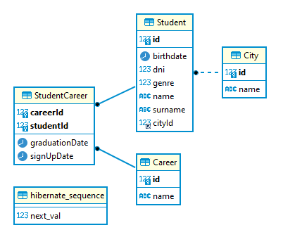

# Arquitecturas Web - Grupo 2

## Integrantes

- Guerrero, Lucas
- Cisneros, Micaela
- De Francesco Germán
- Cinalli, Ezequiel
- Gherbi, Andrea

## Primer entrega

### Instrucciones para ejecutar

Seleccionar el driver en Main.java (alternar implementacion entre DERBY_JDBC o MYSQL_JDBC)

### Aclaracion

Las credenciales para MySql son:
Usuario: root
Password: (vacio)
Puerto: 3306

DerbyDb no tiene credenciales de acceso.

## Segunda entrega

### Instrucciones para ejecutar

Crear base de datos "integrator2DB" dentro de MySql
### Aclaracion

Las credenciales para MySql son:
Usuario: root
Password: (vacio)
Puerto: 3306

### Diagrama entidad - relacion

### Diagrama de clases

